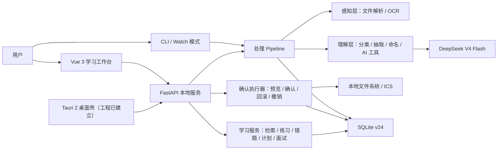

# FileMate

2026-10-04网站密钥404修复已上线，运行提交 `0dd4cc44`：网站使用“保存并测试”，验证成功后按学习空间加密保存在当前浏览器；无效替换保留原配置。AI调用使用请求独立凭据，主动连接测试及错误提示可用；发布与验收见[网站密钥交付](docs/WEB_MODEL_CREDENTIALS_2026-10-04.md)。

2026-10-04密码调整已包含于当前版本；该补丁运行提交为 `8b7add5c`：注册和恢复的新密码改为至少9字符，包含字母和数字，符号可选；已有账号原密码继续可登录。前后端合同与该补丁验收见[密码规则交付](docs/PASSWORD_POLICY_2026-10-04.md)，下方部署记录保留对应历史快照。

2026-10-04上一轮整合网站已上线 `v1.3.0-alpha.4` / schema v25，运行提交 `270ee4f1`：多分类一言、统一资料入口、邮箱账号与恢复码，以及Linux GCC/gVisor真实C++判题。Windows全量807后端、Linux CI 817后端、35前端及类型/构建/体积通过；公网实际模型与双重代码评测42项、账号12组、资料入口9组、一言8组和24页/9接口复测通过。最新发布、备份、证据与边界见[本轮交付](docs/UNIFIED_INTAKE_LINUX_RELEASE_2026-10-04.md)，历史快照继续保留；真实学习研究、邮箱归属验证、桌面安装与持续容量仍待完成。

2026-10-04首页补丁：[诗词一言](docs/HOME_POETRY_DELIVERY_2026-10-04.md)已上线并保留在当前版本。左侧标题不动，右侧银蓝区域从一言诗词库随机获取原文及作者/出处；SPA返回保持，刷新或登录后换句，断网使用缓存和经典备用。此链接的792后端/33前端及8项公网证据属于当时补丁快照。

2026-10-03历史整合版本 `v1.3.0-alpha.3` 已推送主分支并上线。五模块/B2/B3、运维备份、钴蓝界面和学习流程完成整合；当时Linux CI为792后端、21前端，47项TLS/91路径及72项无障碍、公网22页/9接口和6项真实模型合成资料闭环通过。包指纹和限制见[alpha.3发布记录](docs/INTEGRATED_RELEASE_ALPHA3.md)。以下alpha.1–alpha.3阶段记录保留当时状态，不能当作最新线上状态。

2026-10-03后续开发：[DEV-01学习资料入口](docs/LEARNING_TEXT_INPUTS_DELIVERY_2026-10-03.md)已完成，支持UTF-8 Markdown及代码文本本地导入、引用/会话复用和确认图谱；760后端、18前端及类型/构建/原体积门禁通过；最终同包46项TLS父级/91路径、12视觉、17归档、25学习工作区、18知识库通过。原视觉基线`UI-2026.10.03-r1`及交付包保留，新开发基线`DEV-01-2026.10.03`独立固定；下一卡UI-02整合图谱的提取、核对、证据与学习路径。软件仍为`1.3.0-alpha.1`，未部署，真实研究尚未采集。

2026-10-03最新收口：[布局、动效与图标交付](docs/UI_LAYOUT_CLOSEOUT_2026-10-03.md)通过同包46项TLS父级/91路径、12视觉、17归档、23学习工作区及18知识库检查。保留LOGO，统一Tabler公共图标、导航选中反馈和知识证据入口；最终前端18测试/类型/构建/体积通过，默认后端740通过。按[开发流程v2](docs/DEVELOPMENT_WORKFLOW_V2.md)固定本地视觉基线`UI-2026.10.03-r1`；软件仍为`1.3.0-alpha.1`，线上未同步，正式发布与真实研究依赖保留。

2026-10-03最新视觉：[大背景与全站配色重做](docs/BACKGROUND_REDESIGN_DELIVERY_2026-10-03.md)已完成本地实装与验收。重新制作钴蓝、琥珀、银蓝三份整页样例，选择钴蓝光束/冰蓝画布/暖金主动作；740后端、18前端、同包12视觉/17归档/23学习工作区及HTTPS专项通过。旧自然绿方案为历史快照，当前未同步线上。

FileMate 是一个面向大学生的本地优先 AI 学习工作台。它把散落的课程资料转化为可追踪、可复习、可验证的学习资产，并通过“资料导入 → AI 理解 → 用户确认 → 学习计划 → 练习与错题 → 复习与成长分析”形成完整闭环。

> 项目类型：国家级大学生创新创业训练计划项目
> 当前整合版本：`v1.3.0-alpha.4`；当前网站提交、测试与备份见[网站密钥交付](docs/WEB_MODEL_CREDENTIALS_2026-10-04.md)，实际运行以站点 `/release.json` 为准
> 当前工程复核日期：2026-10-04；当前账号与API状态见上方记录，五模块历史验收、B2/B3及界面资料仍保留于[统一资源索引](docs/CURRENT_DELIVERY_INDEX.md)
> 初步版本截止：2026-08-31
> 最终版本截止：2026-09-30

## 1. 先读这里：项目权威入口

第一次接手项目的人或 AI，请按以下顺序阅读，避免被旧计划或目标架构误导：

1. [`AGENTS.md`](AGENTS.md)：AI 和开发者必须遵守的最小开发规则、命令与边界。
2. 本 README：现役能力、真实技术栈、整体结构、路线图和协作方式。
3. [`filemate/docs/API_SPEC.md`](filemate/docs/API_SPEC.md)：Python 核心接口与 HTTP API 合同。
4. [`docs/DEPLOYMENT.md`](docs/DEPLOYMENT.md)：网站生产部署、服务器选型、安全边界与桌面端交付方案。
5. [`PRODUCT.md`](PRODUCT.md)：用户、产品原则、视觉承诺与竞赛证据边界。
6. [`docs/FILEMATE_LEARNING_EVIDENCE_PRODUCT_BLUEPRINT.md`](docs/FILEMATE_LEARNING_EVIDENCE_PRODUCT_BLUEPRINT.md)：长期产品主线与 A＋B 分阶段落地。
7. [`design-system/filemate/MASTER.md`](design-system/filemate/MASTER.md)：钴蓝主视觉与冰蓝阅读 UI 设计系统。
8. 与任务直接相关的源码和测试；代码与文档冲突时，以当前 `main` 代码、测试和 CI 为准，并同步修正文档。

[当前交付资源索引](docs/CURRENT_DELIVERY_INDEX.md)汇集五大模块、B2岗位计划和学习证据说明、B3采集导出与RC准备、API与schema、测试和可复跑命令。历史报告保留当时结果，最新状态以对应交付报告、源码和测试为准。

2026-10-02 后续工程收口：原创7份合成资料连接实际模型完成85项检查；成长页补齐四类证据的样本数、时间、公式及原记录；B3补齐匿名CSV校验导出、分条件探索性区间和[RC准备清单](docs/RC_ACCEPTANCE_CHECKLIST.md)。真实学生与导师数据仍为0，正式版本冻结、团队研究审查和网站同步尚待完成；工具通过不证明学习有效。

2026-10-03 全项目继续推进：已补齐按需组件/样式、首页总依赖体积门禁和页面资源失败恢复；后端718项、前端18项及受影响的浏览器复测通过。完整目标和剩余工作持续记录于[后续执行账本](docs/FULL_PROJECT_EXECUTION_PLAN.md)，当前继续服务与数据运维，不将阶段通过视为项目完成。

运维新增[完整托管备份恢复CLI](docs/BACKUP_RESTORE_RUNBOOK.md)：覆盖主库、匿名分库、附件及有效身份密钥，需预览确认和明确停写，只恢复至新目录；22项专项和19项实际匿名HTTP恢复演练通过。最新全门禁为后端740项、前端18项、类型检查/构建/包预算通过。发布预检、指标、容量和实际服务器/容器演练仍待继续，详见[运维交付](docs/OPERATIONS_BACKUP_DELIVERY_2026-10-03.md)。

实际[HTTPS网关预检](docs/GATEWAY_PREFLIGHT_DELIVERY_2026-10-03.md)已完成：修复API与视觉资源转发、缓存/CSP及超限提前拒绝；40项网关、91个路径、28项页面和4项实际视觉检查通过，8个匿名访客128次读取成功。仅为本机工程验收，指标/配额、Linux容器和正式同步仍待推进。用户最新要求将前端视觉升级提到当前优先级，先完成设计样例和选型，再串行推进整体样式与任务整合。

视觉升级已交付[六站参考、三份样例及“知识生长”首页](docs/FRONTEND_VISUAL_UPGRADE_DELIVERY_2026-10-03.md)，随后合并[资料分类与命名审核](docs/INTEGRATED_FILE_REVIEW_DELIVERY_2026-10-03.md)，一屏预览并确认、撤销或下载日程；最终候选42项TLS网关、91路径、28页面、10视觉和17审核操作通过，原首屏体积预算保持。19组首次回归的面试开发期自动刷新已修复，最终副本的面试14项、页面/接口及生产专项复测通过。下一卡继续学习工作区与五模块界面整合；未部署至线上，真实研究仍待采集。

[学习工作区整合](docs/LEARNING_WORKSPACE_VISUAL_DELIVERY_2026-10-03.md)已交付：大字两栏阅读、资料目录按需展开、笔记/卡片/练习/摘要直接选择，已有内容优先阅读、创建配置按需展开；保留真实保存/引用/作答/下载和输入保护。最终编译包45项父级TLS检查、91路径、28页面、4本地视觉、10首页、17归档和23工作区检查通过；18项前端与原首屏预算通过，后端沿用本轮740项通过的未变源码。模型内容明确为本地合成HTTP合同夹具，不证明模型质量或学习收益；下一卡处理知识与证据入口，再按账本推进五模块。

以下文档属于长期规划或专项材料，不能当作现役实现清单：

- [`docs/FILEMATE_AI_PRODUCT_MASTER_PLAN.md`](docs/FILEMATE_AI_PRODUCT_MASTER_PLAN.md)：长期产品总规划。
- [`docs/ARCHITECTURE.md`](docs/ARCHITECTURE.md)：FileMate 2.0 目标架构，包含尚未落地的图数据库与 Agent 能力。
- [`docs/FILEMATE_COMPETITION_EXECUTION_OUTLINE.md`](docs/FILEMATE_COMPETITION_EXECUTION_OUTLINE.md)：竞赛方向与阶段任务。

## 2. 当前状态一览

### 2.1 已实现并接入主流程

| 能力域 | 当前能力 | 主要入口 |
|---|---|---|
| 资料导入 | PDF、DOC/DOCX、PPT/PPTX、TXT 上传；单文件最大 25 MB | `POST /process`、`Import.vue` |
| 文件理解 | 文本解析、关键词/LLM 分类、课程与任务实体抽取、多里程碑识别、规范命名 | `filemate/perception/`、`filemate/understanding/` |
| 可信执行 | 草稿编辑、最终确认、目标冲突保护、失败回滚、幂等确认、一键撤销 | `confirmation_executor.py` |
| 日程管理 | 从截止日期和里程碑生成 RFC 5545 `.ics`，确认前只预览 | `scheduler.py`、`Schedule.vue` |
| 学习工作区 | 资料/对话/产物同屏；课件、UTF-8 Markdown和代码笔记本地导入一次，复用资料生成摘要/笔记/卡片/练习并恢复会话；源码只作文本阅读 | `workspace.py`、`LearningWorkspace.vue` |
| V2.1 AI 导师讲解 | 从已保存的 AI 回答进入数字人页面，或手动输入文本；浏览器 TTS、分段播报、播放控制、口型动画与可删除的最小日志；V2.1.1 增加超时恢复、取消保护、同页回答切换与记录同步重试 | `DigitalHuman.vue`、`digital-human/`、`/api/digital-human/playbacks` |
| V2.2 知识图谱与学习画像 | 从资料提取有原文依据的节点与关系，核对确认后展示；真实作答更新画像和薄弱点，可确认生成学习路径，保留撤销与操作记录 | `KnowledgeGraph.vue`、`knowledge_graph.py`、`/api/knowledge-graph` |
| V2.3 编程练习与评测 | Monaco C++17 编辑器、8 道原创题、真实隔离编译与逐测试点评分；编程错题、复盘笔记、模型参考建议、全部有效提交统计和撤销恢复 | `Programming.vue`、`filemate/programming/`、`/api/programming` |
| V2.4 面试增强 | 本机视觉观察、录像定位时间轴、六项内容复盘与原句证据；持久报告及 PDF/JSON/Markdown 导出、取消分析与确认删除 | `Interview.vue`、`InterviewReviewPanel.vue`、`filemate/interview_review/` |
| V2.5 求职训练中心 | 核对保存岗位来源与要求，创建原创笔试和岗位面试，引用实际图谱/代码/作答证据；历史对比快照、导出与撤销恢复 | `Career.vue`、`filemate/career/`、`/api/career` |
| 个人知识库 | 资料源、AI 产物、聊天上下文持久化；跨资料检索与引用；六阶段学习资产链 | `storage.py`、`retrieval.py`、`Knowledge.vue` |
| 学习闭环 | 练习作答、自动错题本、资料范围内知识点标识、可修正错因、间隔重复和按时间预算调整的今日复习队列 | `/quiz`、`/wrongbook`、`/review/today` |
| 学习计划 | 根据考试日期生成日计划，持久记录每日完成状态，支持 CSV/ICS 导出 | `StudyPlan.vue` |
| 目标反推 | 依据资料、练习、错题、计划与面试记录诊断差距，生成任务并动态重排 | `goal_planner.py`、`GoalPlanner.vue` |
| 错题口头复练 | 从目标资料中的待纠错题生成口头解释任务，保留失败作答、题目、资料版本及页码/片段引用；证据变化后阻止旧训练并提示重排 | `goal_planner.py`、`interview.py`、`GoalPlanner.vue`、`Interview.vue` |
| 模拟面试 | 摄像头/麦克风独立授权、本地录像回放、语音流畅度与时间轴、资料驱动追问、本地降级 | `interview.py`、`Interview.vue` |
| 可信 Agent | 面试、目标与授权任务按需选择角色；记录真实步骤、来源标识与输出摘要；共享记忆可撤销 | `trusted_agents.py`、`TrustCenter.vue` |
| 版权与隐私 | 资料默认未确认且仅自己可用；授权声明、分享边界与记忆撤销可视化 | `/trust/overview`、`source_rights` |
| 网站访客隔离 | 生产环境为每个浏览器签发不可伪造的 HttpOnly 匿名设备身份，并使用独立 SQLite、上传和归档目录 | `server.py`、`test_server_tenant_isolation.py` |
| 成长数据 | 真实行为统计、匿名反馈导出；求职训练实际计数和原记录回看；学习伙伴表情与阶段由本地学习证据驱动 | `Growth.vue`、`CareerGrowthPanel.vue`、`evaluation/` |
| 多端工程 | Vue Web、FastAPI Sidecar、Tauri 2 桌面工程、CLI | `filemate/web/`、`server.py`、`main.py` |

### 2.2 已有基础，但仍需完善

题集正文修订会为已有作答/错题保留只读历史题集，旧题仍可复练，成绩不会转移到新知识点；过期页面或判题期间的题目变更返回409并要求刷新。机制与旧库不确定证据边界见 [API 规范](filemate/docs/API_SPEC.md#题目修订与学习证据)。本轮结果是本地工程验收，不代表生产网站或 EXE 安装包已经升级；发布状态见 [V2.2 报告](docs/V2_2_KNOWLEDGE_GRAPH_DELIVERY.md)。

前端依用户最新背景要求采用钴蓝光束主视觉、连续冰蓝画布和浅色阅读工作台。首页提供大字“让知识成形”主视觉和「读懂资料 / 复习备考 / 面试求职」方向切换；方向选择仅用于当前页面快捷入口，不作为学习记录保存。9项主要导航配合任务内相关功能及工具查找；分类与命名在同一个[资料审核模块](filemate/web/src/views/FileReview.vue)核对，可保存草稿或一次确认归档，旧分类/命名URL保留。背景动效遵守减弱动画偏好，并在滚出视口时暂停。[新背景来源与改写提示词](docs/BACKGROUND_REDESIGN_PROMPT_2026-10-03.md)记录选型依据；首轮绿白方案保留为历史快照。

`/login`、`/register` 已接入邮箱与密码账号服务，支持游客资料合并、异设备登录及恢复码重设；新密码规则见[密码规则交付](docs/PASSWORD_POLICY_2026-10-04.md)。服务器保存密码哈希及会话，不记录明文密码；邮箱归属验证尚未接入，登录页学习流程仍为示意，不代表用户活动。

| 能力 | 当前边界 | 8–9 月工作重点 |
|---|---|---|
| 检索增强问答 | 当前为本地分块 + BM25 风格词法排序 + 页码/片段引用，不是向量 RAG | 增加可替换 Embedding 适配器、对照评测和稳定引用 |
| 成长画像 | 已有真实行为聚合，不生成虚假数据 | 完善指标解释、时间窗口和空状态 |
| 模拟面试 | 文字/语音、摄像头本地录像回放、时间轴和资料驱动追问可用；浏览器刷新即清除录像 | 组织真实导师盲评，校准系统评分 |
| Tauri 桌面端 | 工程、Sidecar 脚本和图标已具备 | 暂不把安装包作为 8 月初版阻塞项；9 月末视稳定性验收 |
| 真实评测 | 已有离线合成基线和匿名评测管线 | 组织真实学生试用，区分工程基线与真实结论 |

### 2.3 尚未实现，不得对外宣称已完成

- Neo4j 知识图谱、Chroma/其他向量数据库和完整 GraphRAG。
- 用户注册、跨设备账户同步、找回身份和多人协作权限体系；当前匿名设备身份不等同于正式账号。
- 外部数字人供应商、音素级实时口型同步与服务端语音生成；V2.1 目前仅接入浏览器 Web Speech Provider 和近似口型动画。
- 正式监控告警、数据库配额和基于账号的多租户授权；当前仅完成匿名设备级隔离。
- 大规模真实用户实验结论；当前 100% 离线指标只代表小型合成回归集。

## 3. 两个月交付规划

规划原则：完成比堆功能重要；8 月先形成稳定初版，9 月再用真实反馈和质量证据打磨最终版。任何扩展功能不得破坏“资料—练习—错题—计划—复习”的主闭环。

### 3.1 里程碑定义

| 里程碑 | 截止日期 | 版本建议 | 目标 |
|---|---|---|---|
| 初步版本 | 2026-08-31 | `v1.3.0-alpha` | 队友可一键本地运行；六条核心流程完整；无 P0 阻塞缺陷 |
| 最终版本 | 2026-09-30 | `v1.3.0` | 完成真实用户试用、质量加固、接口冻结和交付文档；形成可持续迭代基线 |

### 3.2 2026-08-10 至 2026-08-31：初步版本

| 时间 | 主题 | 必须完成 | 交付与验收 |
|---|---|---|---|
| 08-10～08-16 | 合同与工程收口 | README/API/数据模型对齐；统一错误响应；清理页面假数据和失效入口 | 新成员只看 README 与 AGENTS 即可启动；CI 绿 |
| 08-17～08-23 | 核心闭环联调 | 文件确认/撤销、知识库、问答引用、学习计划、作答错题、今日学习、面试全部串通 | 六条核心用户流程逐条演示；重启后数据仍可恢复 |
| 08-24～08-28 | UI/UX 与可靠性 | 移动端适配、加载/空/错/重试状态、键盘焦点、错误文案、数据导出 | 375px 与桌面宽度可用；主流程无死路；WCAG AA 基础检查 |
| 08-29～08-30 | 冻结与回归 | 停止新增 P2 功能；集中修复 P0/P1；准备匿名演示数据 | 后端测试、Ruff、前端构建、离线评测全部通过 |
| 08-31 | 初版验收 | 打标签、更新版本说明、录制内部演示 | `v1.3.0-alpha` 可由队友在新环境启动并完成验收清单 |

#### 8 月 31 日初版必须通过的六条流程

1. 导入资料 → 自动解析/分类/命名 → 用户编辑 → 最终确认归档 → 撤销恢复。
2. 导入资料 → 生成摘要/知识卡/笔记 → 产物进入个人知识库 → 重启后可查看。
3. 导入资料 → 分块检索 → 提问 → 返回答案与可核对引用。
4. 生成练习 → 提交答案 → 形成错题 → 到期后进入今日复习 → 更新掌握状态。
5. 生成考试学习计划 → 勾选每日任务 → 今日队列自动汇总 → 导出 CSV/ICS。
6. 创建模拟面试 → 连续回答 → 四维反馈 → 成长数据页查看真实统计。

#### 8 月 31 日完成定义（Definition of Done）

- Windows 队友执行 `scripts/dev.ps1 -Setup` 后可启动前后端。
- 所有高影响文件操作必须先预览确认，不覆盖已有目标，并可撤销。
- 数据写入当前 SQLite schema v25，关闭并重启后仍能读取。
- 非 e2e 后端测试不得少于当前 `370 passed` 基线；新增功能必须新增测试。
- `npm run build`、CI 静态检查和离线评测通过。
- P0 缺陷为 0；P1 缺陷必须有负责人、复现步骤和明确截止日期。
- README、API 文档和实际路由一致；不把计划功能写成已实现。
- 安装包不是本里程碑阻塞项，本地运行成功即可验收。

### 3.3 2026-09-01 至 2026-09-30：最终版本

| 时间 | 主题 | 必须完成 | 可选扩展 |
|---|---|---|---|
| 09-01～09-07 | Alpha 反馈修复 | 至少 5 名队内/种子用户走完核心流程；修复全部 P0 和高频 P1 | 引导式新手任务 |
| 09-08～09-14 | 检索与学习证据 | 扩充检索数据集；对比整篇截断与分块检索；完善引用和错因证据 | Embedding 适配器，保留本地词法回退 |
| 09-15～09-21 | 个性化与面试 | 学习画像解释、计划动态调整、面试题库与评分证据、匿名导出 | 语音输入优化；数字人供应商接口原型 |
| 09-22～09-26 | 稳定性与隐私 | 性能、数据库迁移、异常恢复、敏感数据说明、可访问性与响应式复核 | 手动执行 Tauri 安装包验收 |
| 09-27～09-29 | Release Candidate | 冻结接口；全量回归；真实用户报告；使用与开发文档冻结 | 演示视频和竞赛材料接口预留 |
| 09-30 | 最终验收 | 发布 `v1.3.0`；归档机器可读证据；形成下一阶段 backlog | 是否进入 FileMate 2.0 由验收结果决定 |

#### 9 月 30 日完成定义

- 至少 10 名真实学生完成 beta 试用，记录匿名任务完成率、耗时与 SUS；样本不足时必须标记为待评测。
- 正式竞赛结论仍遵循 [`docs/REAL_USER_EVALUATION_PROTOCOL.md`](docs/REAL_USER_EVALUATION_PROTOCOL.md) 的 30 人门槛，不能用 10 人 beta 冒充正式实验。
- P0、P1 缺陷均为 0；P2 有清晰 backlog，不阻塞主要流程。
- 核心接口冻结，数据库迁移可从旧版本幂等升级。
- 检索、面试、学习计划至少各有一组可复现评测和机器可读报告。
- 新机器按 README 能在 30 分钟内完成安装、配置、启动和首个学习任务。
- GitHub Actions 全绿；版本标签、变更说明、用户说明和开发接手文档齐全。

### 3.4 优先级边界

| 优先级 | 内容 | 处理原则 |
|---|---|---|
| P0 | 数据丢失、错误覆盖文件、无法启动、数据库不可升级、核心流程中断 | 立即停止新增功能并修复 |
| P1 | 结果错误、状态无法恢复、主要页面不可用、引用不可信 | 当前周内修复，不能带入最终版 |
| P2 | 动画、次要统计、题库扩充、视觉细节、非核心导出 | 不得挤占 P0/P1 时间 |
| Stretch | 数字人、知识图谱、向量数据库、云同步、多人协作 | 核心闭环稳定且有独立负责人后才启动 |

## 4. 现役系统架构


```mermaid
flowchart LR
    U["用户"] --> V["Vue 3 学习工作台"]
    U --> C["CLI / Watch 模式"]
    V --> A["FastAPI 本地服务"]
    T["Tauri 2 桌面壳（工程已建立）"] --> A
    C --> P["处理 Pipeline"]
    A --> P
    P --> R["感知层：文件解析 / OCR"]
    P --> N["理解层：分类 / 抽取 / 命名 / AI 工具"]
    N --> L["DeepSeek V4 Flash"]
    A --> E["确认执行器：预览 / 确认 / 回滚 / 撤销"]
    A --> K["学习服务：检索 / 练习 / 错题 / 计划 / 面试"]
    E --> F["本地文件系统 / ICS"]
    P --> S["SQLite v24"]
    E --> S
    K --> S
```

### 4.1 核心数据流

```text
文件上传
  → 保存到 .filemate-data/inbox/<随机目录>
  → FileParser 提取文本和元数据
  → Classifier / EntityExtractor / MilestoneDetector / Namer
  → Session 草稿写入 SQLite
  → 前端展示分类、命名和日历预览
  → 用户修改并最终确认
  → ConfirmationExecutor 原子归档并按需生成 ICS
  → 写入 execution_records 与 operation_log
  → 用户可查询历史或执行撤销
```

### 4.2 学习闭环数据流

```text
Source（原始资料）
  → document_chunks（可引用片段）
  → Artifact（摘要/知识卡/题目/笔记/学习计划）
  → QuizAttempt（作答证据）
  → WrongQuestion（错题与间隔重复状态）
  → TodayReview（今日队列）
  → Analytics（真实行为聚合）
```

### 4.3 可信执行不变量

- 分析阶段只生成草稿，不移动原文件、不写入日历文件。
- 最终确认前允许用户修改分类、课程、名称和日历开关。
- 目标文件或日历已经存在时拒绝覆盖。
- 文件移动或日历生成任一步失败时，尽可能恢复到执行前状态。
- 重复确认和重复撤销必须幂等，不重复修改文件系统。
- 文件扩展名不可通过重命名伪造，目录和文件名必须通过路径安全校验。
- Session、执行记录与审计日志保持一致，可从 SQLite 恢复。

## 5. 真实技术栈

| 层 | 现役技术 | 说明 |
|---|---|---|
| Web 前端 | Vue 3.5、TypeScript 6、Vite 8 | 单页应用与按路由懒加载 |
| UI 与状态 | Element Plus 2、Pinia 4、Vue Router 4、ECharts 6 | 钴蓝主视觉、冰蓝画布与浅色阅读系统 |
| 本地 API | FastAPI、Uvicorn、Pydantic | 默认监听 `127.0.0.1:8001` |
| 桌面壳 | Tauri 2、Rust | 工程已建立；安装包仅手动验收 |
| 核心语言 | Python 3.10+ | 推荐 3.11/3.12；统一 UTF-8 |
| 数据存储 | SQLite WAL，schema v25 | 本地优先、版本迁移、线程连接管理；生产环境按匿名设备分库 |
| 文件解析 | PyPDF2、pdfplumber、python-docx、python-pptx | PaddleOCR 为可选依赖 |
| 检索 | 本地分块 + BM25 风格词法评分 | 支持页码/片段引用；无外部向量库 |
| LLM | DeepSeek V4 Flash；OpenAI 兼容 HTTP API | 通过 `LLMClient` 和 Provider 适配层接入 |
| 测试与质量 | pytest、Ruff、vue-tsc、GitHub Actions | e2e 模型测试与普通离线测试分离 |

计划中的 Neo4j、Chroma、BGE 与外部数字人供应商不是当前运行依赖。现役数字人采用浏览器语音，网站已有独立部署；新增外部能力必须通过适配层接入，并保留本地可运行的降级路径。

## 6. 目录结构与职责

```text
FileMate/
├── AGENTS.md                         # AI/开发者最小项目规则
├── README.md                         # 项目现役总入口与两个月规划
├── PRODUCT.md                        # 产品定位、原则与证据边界
├── DESIGN.md                         # UI 设计系统摘要
├── pyproject.toml                    # Python 包、依赖、pytest、Ruff 配置
├── uv.lock                           # Python 可复现依赖锁
├── server.py                         # FastAPI 本地服务与 HTTP 路由
├── main.py                           # CLI、watch 模式和处理阶段链
├── 启动FileMate.bat                   # Windows 队友入口
├── scripts/
│   ├── setup-dev.ps1                 # 首次安装开发依赖
│   ├── doctor.ps1                    # 环境诊断
│   ├── dev.ps1                       # 启动 FastAPI + Vue
│   ├── stop-dev.ps1                  # 停止本次开发服务
│   ├── verify.ps1                    # Ruff + pytest + 前端构建
│   └── seed_demo_data.py             # 生成匿名演示数据
├── filemate/
│   ├── core/                         # Session、Pipeline、Agent 协调与注册表
│   ├── llm_client/                   # LLM 配置、Provider 和统一调用封装
│   ├── perception/                   # 文件解析、OCR、watcher、解析器注册
│   ├── understanding/                # 分类、实体、里程碑、命名、检索、AI 工具、面试
│   ├── study/                        # 文本切片、题目规范化、判题与复习排期纯函数
│   ├── execution/                    # SQLite、文件操作、日历、归档、确认执行和撤销
│   ├── ui/                           # 旧 Gradio 兼容入口与后端桥接；非主前端
│   ├── tests/                        # 单元、集成、压力和可选 e2e 测试
│   ├── docs/                         # API、Prompt 与开发接口文档
│   └── web/
│       ├── src/                      # Vue 页面、路由、API 客户端、Pinia
│       └── src-tauri/                # Tauri 2 配置、Rust 壳与桌面图标
├── evaluation/                       # 离线评测、用户研究与匿名反馈分析
├── docs/                             # 产品规划、竞赛、验收与目标架构文档
├── design-system/filemate/           # UI 设计规则真身
└── .github/workflows/ci.yml          # 后端、前端 CI；安装包仅手动触发
```

### 6.1 模块边界

| 模块 | 可以负责 | 不应该负责 |
|---|---|---|
| `perception` | 文件格式判断、正文和元数据提取、OCR 回退 | 分类、文件移动、UI 状态 |
| `understanding` | 分类、实体、命名、检索、AI 学习内容和评分 | 直接写磁盘或直接操作 HTTP |
| `study` | 可复用的切片、出题结果规范化、判题和复习排期算法 | 自建重复数据库表或直接绑定某个 UI |
| `execution` | 持久化、文件归档、日历、事务式确认和撤销 | Prompt 和页面渲染 |
| `core` | Session 状态、Pipeline 编排、Agent 协调、注册表 | 具体业务页面与外部供应商细节 |
| `server.py` | HTTP 合同、参数校验、服务编排、统一错误 | 重复实现底层领域算法 |
| `web` | 用户交互、状态反馈、响应式布局、API 调用 | 直接读取 SQLite 或本地任意路径 |

## 7. SQLite v24 数据模型

数据库由 `schema_migrations` 管理，`init_schema()` 必须保持幂等。不要直接修改已经发布的迁移；新增字段或表必须增加新版本迁移和升级测试。

| 版本 | 主要表/变化 | 用途 |
|---:|---|---|
| v1 | `sessions`、`processed_files`、`operation_log`、`user_rules` | 文件处理、去重、审计、用户规则 |
| v2 | `workspaces`、`sources`、`artifacts`、`document_contexts` | 知识资料、AI 产物和连续问答 |
| v3 | `execution_records` | 确认执行、失败、撤销和幂等 |
| v4 | `document_chunks`、`quiz_attempts`、`wrong_questions` | 检索、作答和错题闭环 |
| v5 | `interview_sessions`、`interview_turns` | 模拟面试过程与评分 |
| v6 | `study_plans` | 学习计划和每日完成状态 |
| v7 | `product_feedback` | 匿名正负反馈和统计 |
| v8 | 错题间隔重复字段与索引 | 下次复习时间、间隔、难度因子、复习次数 |
| v9 | `interview_questions`、`interview_sessions.question_ids` | 可维护面试题库与选题来源追踪 |
| v12 | 题库兼容修复 | 修复未合并实验迁移曾占用 v9-v11 的本地数据库；v10-v11 不作为正式迁移复用 |
| v13 | `interview_turns.fluency_metrics` | 持久化语音回答时长、字速、口头语、较长停顿和流畅度参考分 |
| v14 | `agent_runs`、`agent_steps`、`agent_memories`、`source_rights` | 真实 Agent 轨迹、可撤销摘要记忆、资料授权与分享边界 |
| v15 | `interview_turns.scoring_mode`、`scoring_version` | 区分模型评分、本地降级与历史未知来源，避免把降级结果误报为模型评分 |
| v16 | `wrong_questions` 知识点与错因字段 | 保存资料范围内稳定知识点标识、本地规则建议、用户确认的错因与备注 |
| v17 | `digital_human_playbacks` | 当前身份的播报字数、声线、形象、状态和时间；不保存正文或音频，支持软删除 |
| v18 | `knowledge_graph_batches` | 本地知识图谱的草稿、确认和撤销记录 |
| v19 | `daily_coach_preferences` | 按日期保存今日可用时长和用户调整的任务顺序 |
| v20 | `interview_sessions.expression_review` | 错题表达复练的结构化记录 |
| v21 | `knowledge_graph_events` | 图谱提取、失败、确认、撤销、恢复及学习路径操作元数据；随资料级联删除 |
| v22 | `coding_submissions` / `coding_events` | C++ 提交索引、取消和撤销状态、幂等请求键、最小操作日志；代码/判题/复盘保存为现役 Artifact |
| v23 | `interview_review_state` / `interview_review_events`；回答新增观察、内容证据及请求键 | 面试分析取消修订、幂等回答、确认删除；报告复用 `interview_report` Artifact |
| v24 | `career_positions` / `career_trainings` / `career_events` | 岗位来源与修订、训练快照索引与有限操作日志；训练正文复用 Artifact |

关键关系：

- `Source` 是原始学习资料的统一身份。
- `Artifact` 是由 Source 派生的摘要、题目、笔记或计划。
- `Context` 保存连续问答上下文。
- `QuizAttempt` 和 `WrongQuestion` 保存学习证据，不能只存在前端内存。
- `ExecutionRecord` 是文件副作用的审计与撤销依据。
- `AgentRun` 只记录实际被选择并执行的角色，不把能力目录冒充运行状态。
- `AgentMemory` 只保存摘要、来源标识和可用角色；不复制面试回答原文。

## 8. HTTP API 总览

所有业务接口统一返回：

```json
{
  "success": true,
  "data": {},
  "error": null
}
```

参数错误使用 `400/422`，资源不存在使用 `404`，执行冲突使用 `409`，模型上游失败使用 `502`。前端读取 `error`，不要依赖 FastAPI 默认 `detail`。

### 8.1 健康与文件处理

| 方法 | 路径 | 作用 |
|---|---|---|
| GET | `/api/health` | Web/桌面壳探测本地服务版本 |
| POST | `/process` | 上传并处理资料，返回 Session 草稿 |
| GET | `/sessions` | 查询处理历史 |
| GET | `/sessions/{id}` | 查询单个 Session |
| PATCH | `/sessions/{id}` | 保存分类、名称或实体草稿，无文件副作用 |
| POST | `/sessions/{id}/confirm` | 最终执行或跳过 |
| POST | `/sessions/{id}/undo` | 撤销已应用的文件操作 |
| GET | `/sessions/{id}/executions` | 查询执行历史 |
| GET | `/sessions/{id}/ics` | 获取日历内容 |

### 8.2 AI 学习工具与知识库

| 方法 | 路径 | 作用 |
|---|---|---|
| POST | `/ai/summarize` | 生成摘要并持久化 Artifact |
| POST | `/ai/knowledge-cards` | 生成知识卡 |
| POST | `/ai/questions` | 生成练习题并建立题目资产 |
| POST | `/ai/notes` | 生成结构化笔记 |
| POST | `/ai/chat` | 基于资料分块连续问答，返回引用 |
| GET | `/knowledge/sources` | 列出资料源 |
| GET | `/knowledge/sources/{id}` | 获取资料正文和元数据 |
| GET | `/knowledge/sources/{id}/artifacts` | 查询资料派生产物 |
| GET | `/knowledge/sources/{id}/lineage` | 汇总资料到练习、错题、计划和面试的资产链 |
| PUT | `/knowledge/sources/{id}/rights` | 声明资料权利来源与分享范围 |
| GET/PATCH | `/knowledge/artifacts/{id}` | 查看或修改学习产物 |
| GET | `/knowledge/search?q=...` | 跨资料本地检索 |

### 8.3 学习闭环、面试和评测

| 方法 | 路径 | 作用 |
|---|---|---|
| POST | `/ai/study-plan` | 生成并保存学习计划 |
| GET | `/study-plans` | 列出学习计划 |
| PATCH | `/study-plans/{id}/days/{index}` | 更新每日完成状态 |
| POST | `/goals/reverse-plan` | 从目标和真实证据反推任务 |
| GET | `/goals` | 列出已保存目标 |
| PATCH | `/goals/{id}/tasks/{task_id}` | 更新目标任务完成状态 |
| POST | `/goals/{id}/replan` | 依据最新证据动态重排 |
| POST | `/quiz/attempts` | 提交作答并更新错题 |
| GET | `/wrongbook` | 查询未掌握/已到期错题 |
| GET | `/review/today` | 聚合今日计划与到期错题 |
| POST | `/interviews` | 创建模拟面试 |
| GET | `/interviews/{id}` | 获取面试进度 |
| POST | `/interviews/{id}/answers` | 提交回答并评分 |
| GET/POST | `/interviews/{id}/review` | 读取或生成持久化面试复盘报告 |
| POST | `/interviews/{id}/turns/{turn_id}/analyze` | 确认外发后分析原回答，保留各维度原句证据 |
| GET | `/interviews/{id}/review/export` | 下载 PDF、JSON 或 Markdown 报告 |
| POST | `/interviews/{id}/analysis/cancel`、`/analysis/clear` | 取消迟到分析，或确认清空派生结果 |
| GET/DELETE | `/interviews/{id}/delete-preview`、`/interviews/{id}` | 预览后确认删除本场练习 |
| GET/POST | `/interview/questions` | 筛选题库或新增题目 |
| PATCH/DELETE | `/interview/questions/{id}` | 更新、启停或删除题目 |
| GET | `/analytics/overview` | 获取真实学习行为统计 |
| POST | `/evaluation/feedback` | 保存匿名产品反馈 |
| GET | `/evaluation/feedback/summary` | 获取反馈摘要 |
| GET | `/evaluation/feedback/export.csv` | 导出匿名反馈 |
| GET | `/trust/overview` | 获取真实 Agent 轨迹、共享记忆和资料授权状态 |
| DELETE | `/agents/memories/{id}` | 撤销共享记忆的后续使用权限 |

完整字段和边界见 [`filemate/docs/API_SPEC.md`](filemate/docs/API_SPEC.md)，交互调试访问 `http://127.0.0.1:8001/docs`。

## 9. 前端页面与对应能力

| 路由 | 页面 | 主要职责 |
|---|---|---|
| `/` | 学习工作台 | 汇总核心任务、资料和学习状态 |
| `/today` | 今日学习 | 聚合逾期/当日计划和到期错题 |
| `/import` | 导入文件 | 上传、处理进度与错误恢复 |
| `/classification` | 分类预览 | 修改分类和课程信息 |
| `/naming` | 命名预览 | 修改最终文件名 |
| `/schedule` | 日程预览 | 查看里程碑和日历内容 |
| `/history` | 历史记录 | Session、执行状态和撤销 |
| `/ai-tools` | AI 工具箱 | 摘要、卡片、题目、笔记、问答 |
| `/digital-human` | AI 导师讲解 | 朗读已保存的 AI 回答或手动讲解稿；语音控制、字幕、形象切换与播放记录 |
| `/career` | 求职训练中心 | 岗位来源核对、原创笔试、算法与面试训练、证据对比 |
| `/study-plan` | AI 学习计划 | 生成、查看和完成每日任务 |
| `/goals` | 目标反推 | 目标、证据、能力缺口、行动任务与动态重排 |
| `/wrongbook` | 错题复盘 | 错题、掌握状态和复习安排 |
| `/interview` | 模拟面试 | 场景、摄像头本地预览、语音流畅度、分项评分与反馈 |
| `/interview-bank` | 题库管理 | 筛选、新增、编辑、启停和删除面试题目 |
| `/growth` | 成长数据 | 真实行为统计、证据驱动伙伴阶段与匿名反馈导出 |
| `/knowledge` | 个人知识库 | 资料、产物、跨资料检索、编辑和六阶段资产链 |
| `/trust` | 可信与隐私 | Agent 时间线、共享记忆撤销、资料授权与分享边界 |

视觉遵循用户2026-10-03最新要求：钴蓝光束主视觉、冰蓝背景、清晰的浅色正文和集中动作，真实数据优先；不使用紫粉 AI 渐变、Emoji 功能图标、虚构准确率或无意义机器人视觉。原自然绿限定已由该次明确要求替代。

## 10. 本地开发与运行

### 10.1 环境要求

- Windows 11 为主要开发平台；macOS/Linux 可运行 Web 与 CLI。
- Python 3.10+，推荐 3.11/3.12。
- Node.js 24（与 CI 对齐）。
- `uv`、Git；桌面端开发另需 Rust stable/MSVC。

### 10.2 Windows 一键启动

```powershell
# 首次：安装 Python 与前端依赖并检查环境
powershell -ExecutionPolicy Bypass -File scripts/dev.ps1 -Setup

# 后续：启动 FastAPI 和 Vue
powershell -ExecutionPolicy Bypass -File scripts/dev.ps1

# 不自动打开浏览器
powershell -ExecutionPolicy Bypass -File scripts/dev.ps1 -NoBrowser

# 停止本次启动的服务
powershell -ExecutionPolicy Bypass -File scripts/stop-dev.ps1

# 仅诊断环境
powershell -ExecutionPolicy Bypass -File scripts/doctor.ps1

# 首次载入经审核的 45 道面试种子题；重复执行不会重复写入
uv run python scripts/seed_interview_bank.py
```

也可双击 `启动FileMate.bat`。启动后：

- Web：`http://127.0.0.1:5173`
- API：`http://127.0.0.1:8001`
- Swagger：`http://127.0.0.1:8001/docs`

### 10.3 手动启动

```powershell
# 项目根目录
uv sync --extra dev
Copy-Item .env.example .env
# 编辑 .env，填入真实 LLM 配置

# 或安全地交互写入 DeepSeek API Key（输入不会回显）
powershell -ExecutionPolicy Bypass -File scripts/configure_deepseek.ps1

# 终端 1
uv run python server.py

# 终端 2
Set-Location filemate/web
npm ci
npm run dev
```

### 10.4 CLI

```powershell
uv run python main.py <文件路径>
uv run python main.py <文件路径> --no-calendar
uv run python main.py --watch-dir <监控目录>
uv run python main.py --check --db _working/check.db
```

## 11. 环境变量与本地数据

不要提交真实 `.env`、API Key、个人资料、数据库或用户导出文件。

| 变量 | 默认值/要求 | 用途 |
|---|---|---|
| `LLM_PROVIDER` | `auto` | 根据 Base URL 选择 Provider |
| `LLM_API_KEY` | AI 功能需要 | 模型密钥 |
| `LLM_BASE_URL` | `https://api.deepseek.com` | DeepSeek OpenAI 兼容 API 地址 |
| `LLM_MODEL` | `deepseek-v4-flash` | 项目统一模型名称 |
| `FILEMATE_DATA_DIR` | `<项目>/.filemate-data` | 本地应用数据根目录 |
| `FILEMATE_UPLOAD_DIR` | `<DATA_DIR>/inbox` | 上传暂存目录 |
| `FILEMATE_DB_PATH` | `<DATA_DIR>/filemate.db` | SQLite 文件 |
| `FILEMATE_ARCHIVE_DIR` | `<项目>/archive` | 最终归档目录 |
| `FILEMATE_HOST` | `127.0.0.1` | API 监听地址；生产容器内设为 `0.0.0.0` |
| `FILEMATE_PORT` | `8001` | API 监听端口 |
| `FILEMATE_SHUTDOWN_TOKEN` | 桌面宿主注入 | 只允许本机优雅关闭 Sidecar |
| `FILEMATE_INTERVIEW_LOCAL_ONLY` | `1` 时强制本地评分 | 面试隐私/离线模式 |
| `FILEMATE_ENABLE_INTERVIEW_REVIEW` | `1` | 设为 `0` 时关闭 V2.4 分析、报告、清空/删除和导出接口；原有面试仍可使用 |
| `VITE_ENABLE_INTERVIEW_REVIEW` | 开启 | 前端构建时设为 `false`，隐藏视觉观察与增强报告，保留原面试页面 |
| `FILEMATE_ENABLE_CAREER` | `1` | 设为 `0` 关闭 V2.5 求职接口，状态仍可读取；保留原学习、编程与面试 |
| `VITE_ENABLE_CAREER` | 开启 | 前端构建时设为 `false` 隐藏求职导航，旧 `/career` 链接返回学习工作区 |
| `FILEMATE_ENABLE_DIGITAL_HUMAN` | `1` | 设为 `0` 时独立关闭数字人日志 API；其他学习接口继续可用 |
| `VITE_ENABLE_DIGITAL_HUMAN` | 开启 | 前端构建时设为 `false`，关闭数字人页面并隐藏导航与回答讲解入口；旧讲解链接返回学习工作区 |
| `FILEMATE_ENABLE_KNOWLEDGE_GRAPH` | `1` | 设为 `0` 时关闭 V2.2 图谱接口，不影响其他学习接口 |
| `VITE_ENABLE_KNOWLEDGE_GRAPH` | 开启 | 前端构建时设为 `false`，隐藏知识图谱路由和入口 |
| `FILEMATE_ENABLE_PROGRAMMING` | `1` | 设为 `0` 时关闭编程 API，保留提交数据与其他模块 |
| `VITE_ENABLE_PROGRAMMING` | 开启 | 前端构建时设为 `false`，隐藏编程导航，旧 `/programming` 地址转到学习工作区 |
| `FILEMATE_CPP_TOOLCHAIN_DIR` | 项目 `_working/cpp-toolchain` | 本机 MSVC/SDK 的专用只读副本；评测工作目录在其相邻 `cpp-runs` 中 |
| `FILEMATE_JUDGE_SOCKET` | `/run/filemate-judge/judge.sock` | Linux独立gVisor代理客户端地址；代理部署配置不向Web暴露Docker权限 |

未配置模型密钥时，Web、历史、持久化和部分本地功能仍可启动；需要模型的能力应返回明确配置提示，不能静默伪造结果。

求职训练中心提供少量有日期和官方链接的岗位摘要，并支持本地TXT/Markdown导入。核对要求原句后才保存，岗位修改不会重写旧训练。基础题由平台原创，算法训练复用C++17引擎，岗位口头训练复用V2.4；不声称企业真题或实时招聘信息。证据对比展示实际训练量与引用，无样本为待评测，不生成岗位适配率或录用结论。删除求职岗位保留原资料、图谱、编程提交及面试，面试可单独在V2.4删除。完整边界与验收见 [V2.5交付报告](docs/V2_5_CAREER_DELIVERY.md)。

成长数据页同步展示已保存岗位、完成的基础笔试、实际答对/作答题数、岗位面试已答/已评估题数和对比快照。汇总读取全部有效训练，包含撤销岗位的历史；最近五份记录可直接回看，异常记录保留并说明排除数量。刷新只读，读取失败保留已显示的证据，求职开关关闭时隐藏该面板。没有作答时显示待评测，完成数量不转为能力分或招聘效果。

岗位学习计划按本地规则列出最近基础题错误、待复习关联和最近失败代码提交的原记录，并对无作答要求显示待评测。先预览确认，再原子新增现役学习计划和证据快照；已有计划及进度保留，同证据重试不会重复保存。支持原练习链接、每日进度、CSV/日历导出和撤销恢复。删除岗位时同时预览并清除该岗位生成的计划和进度，保留其他学习计划。当前最多安排7项、每天建议30分钟，不调用模型或据此修改能力画像；范围与验收见 [B2岗位学习闭环](docs/B2_CAREER_LEARNING_PLAN_DELIVERY.md)。

面试页面默认本地保存回答，视觉观察须主动开启。MediaPipe 模型及运行时从本机同源资源加载；摄像头录像只在当前页面内存，支持用户主动下载，刷新后清除。业务服务只接收有限观察摘要，不接收录像、音频、帧或人脸坐标。浏览器语音识别可能使用浏览器厂商在线服务，页面明确提示。开启外部内容分析前逐题确认发送问题、回答和训练方向；四维模型分数与六项内容建议均须含原句证据，失败保留旧结果，无模型时不生成内容分数。

复盘报告作为 Artifact 持久化，可导出嵌入中文字体的 PDF、JSON 和 Markdown。清空分析保留原回答和语音节奏，删除整场须先预览影响并确认。视觉比例只是实际采样统计，不推断情绪、人格或录用结果；真实专家校准仍为“待评测”。匿名盲评模板和 Spearman 工具见 [V2.4 交付报告](docs/V2_4_INTERVIEW_REVIEW_DELIVERY.md)。

编程模块当前支持 Windows x64 与本机已安装的 Visual Studio C++ 桌面开发组件/Windows SDK。页面中的“准备本地评测环境”复制工具链到应用目录并执行真实隔离自检，不安装系统组件。编译使用无网络能力的 AppContainer，运行使用 LPAC，均绑定 Job Object；Windows BFE/MpsSvc 服务不可用时拒绝执行。学生程序限制为单进程、256 MB、每点 1 秒、输出 64 KB；编译上限 30 秒/768 MB/8 进程。使用标准 C++17 头文件，不支持 GCC 专用 `bits/stdc++.h`。Linux现役网站新增独立gVisor/GCC适配器，受限Unix socket连接、真实隔离自检、逐测试点结果和取消清理；部署见[scripts/judge/README.md](scripts/judge/README.md)。macOS或环境未就绪时可查看题目/历史，评测入口关闭。

代码复盘与正确性裁决分开。本地提示自动保存；外部模型需要用户确认发送题面、代码和测试结果，模型反馈须校验源代码行号与全部失败测试点编号。模型失败保留原判题和既有复盘。类别通过率、本周记录、每题平均提交次数均来自有效完成记录，取消、基础设施失败与撤销记录不进入统计。

编程历史中损坏或无法对应固定题目版本的记录暂停操作、排除统计并保留原始字节；单条损坏的孤立运行记录不会阻断记录页。V2.3历史报告记录首次本地工程验收；Linux网站适配验收新增于[本次交付](docs/LINUX_CPP_DELIVERY_2026-10-04.md)，独立安装包更新仍待完成，具体证据与限制见 [V2.3报告](docs/V2_3_PROGRAMMING_DELIVERY.md)。

点击右上角“设置”可填写自己的 DeepSeek API 密钥。桌面端/本机Web保存到当前系统用户凭据库；网站使用“保存并测试”，真实连接验证成功后按学习空间加密保存在当前浏览器IndexedDB，不同步至其他设备。仅主动AI请求临时携带密钥，后端请求隔离并强制官方HTTPS地址；不写服务器配置、SQLite、日志或Git。错误替换保留原配置，移除后可回退至部署环境变量。浏览器加密依赖同源脚本与本机可信，不能等同于系统凭据库的保护；机制、404复现及当前验收见[网站密钥交付](docs/WEB_MODEL_CREDENTIALS_2026-10-04.md)。

## 12. 测试、质量门禁与评测

```powershell
# 推荐：一次完成 Ruff、后端测试和前端生产构建
powershell -ExecutionPolicy Bypass -File scripts/verify.ps1

# 后端非 e2e 测试
uv run pytest filemate/tests -q -m "not e2e"

# SQLite 多线程压力测试
uv run python filemate/tests/stress_test_storage.py

# 前端类型检查与生产构建
Set-Location filemate/web
npm test
npm run build

# 无服务器临时公网演示（共享前必须保管好输出的访问密码）
Set-Location ../..
powershell -ExecutionPolicy Bypass -File scripts/start_quick_tunnel.ps1

# 离线产品评测
uv run python evaluation/run_evaluation.py --output _working/evaluation-report.json
```

2026-08-27 发布基线：

- 后端：`391 passed, 18 skipped, 5 deselected`。
- SQLite 压力测试：10 线程、5000 次操作、0 错误。
- Vue 类型检查和 Vite 生产构建通过。
- GitHub Actions 后端与前端任务通过。
- 安装包任务只在 `workflow_dispatch` 手动触发，不阻塞当前功能开发。

离线检索基线是小型合成数据，只用于工程回归。真实用户结论必须报告样本量、日期、数据属性和置信区间，禁止把示例 CSV 或演示数据冒充实测。

## 13. 如何扩展功能

### 13.1 新增文件解析器

1. 在 `filemate/perception/parsers/` 新建单一格式解析器。
2. 返回稳定的 `raw_text` 和 `metadata`。
3. 在解析器注册表中注册后缀；同步 `server.py` 上传白名单。
4. 增加正常文件、空文件、损坏文件和大文件测试。
5. 更新 README 支持格式与 API 文档。

### 13.2 新增 AI 学习工具

1. 在 `filemate/understanding/ai_tools.py` 或独立领域模块实现纯业务逻辑。
2. 通过 `LLMClient` 调模型，不在业务代码硬编码供应商或密钥。
3. 明确输入、结构化输出、失败降级和内容长度边界。
4. 在 `storage.py` 复用 Source/Artifact/Context；需要 schema 时新增迁移。
5. 在 `server.py` 增加统一响应路由，在 `api.ts` 增加类型化客户端。
6. 新增 Vue 页面/组件、路由、加载/空/错/重试状态和测试。

### 13.3 新增前端板块

1. 在 `src/views/` 建页面，在 `router/index.ts` 注册懒加载路由。
2. API 调用只放 `src/services/api.ts`，共享类型放 `src/types/`。
3. 复用 Pinia 状态，不把持久数据只放组件局部变量。
4. 遵循当前钴蓝与冰蓝设计系统，使用 `@element-plus/icons-vue`。
5. 验证桌面、900px 和 375px；状态不能只靠颜色表达。

### 13.4 新增 LLM/Embedding/数字人供应商

1. 先定义最小 Provider 协议和统一返回结构。
2. 在适配层实现，不让业务模块依赖供应商 SDK 类型。
3. 部署密钥读取环境变量；用户自带密钥遵守系统凭据/浏览器加密及单请求隔离合同，日志不得打印密钥、完整敏感资料或原始回答。
4. 提供超时、重试、错误翻译和本地/离线回退。
5. 用 contract test 验证替换供应商不会改变上层 API。

### 13.5 新增数据库迁移

1. 不修改已经发布的 v1–v8 迁移内容。
2. 新增 `_MIGRATIONS` 版本、幂等升级逻辑和索引。
3. 测试新库初始化、旧库升级、重复执行和失败回滚。
4. 更新 API_SPEC、README 数据模型和导出/删除边界。

## 14. 团队协作规则

### 14.1 建议分工

| 方向 | 主要路径 | 当前负责人/协作方式 |
|---|---|---|
| 总体架构、LLM、集成与发布 | `core/`、`llm_client/`、CI | 胡希统筹 |
| 感知与解析 | `perception/` | 汤新阳主责 |
| 理解、Prompt 与学习算法 | `understanding/` | 张金宝主责 |
| 执行、存储和可靠性 | `execution/` | 徐书和主责 |
| Vue UI/UX | `filemate/web/` | 余恒主责 |
| 产品、评测与跨模块联调 | `docs/`、`evaluation/`、各模块 | 杨乐及全体协作 |

实际任务以负责人最新分配为准；表格用于告诉 AI 从哪里找代码，不作为权限系统。

### 14.2 Git 与提交

```text
main
 ├─ feat/<模块>-<能力>
 ├─ fix/<模块>-<问题>
 └─ docs/<主题>
```

- 从最新 `main` 建短分支，提交小而完整的改动。
- Conventional Commit：`type(scope): 中文简述`。
- 不提交 `.env`、数据库、真实用户资料、`node_modules`、构建产物或 `_working`。
- 修改公共 API、schema、环境变量或路由时，必须同步代码、测试、README/API 文档和调用方。
- 合并前执行 `scripts/verify.ps1`；需要真实密钥的 e2e 测试单独标记。

## 15. AI 辅助开发接手模板

队友可以把下面内容直接交给 AI，再补充具体任务：

```text
你正在协助开发 FileMate（大学生本地优先 AI 学习工作台）。

开始前必须：
1. 完整阅读根目录 AGENTS.md、README.md。
2. 阅读 filemate/docs/API_SPEC.md，以及任务相关源码和测试。
3. 用当前 main 代码、SQLite migration、Vue 路由和测试核对文档，不把目标架构当现役实现。

开发约束：
- 保持 FastAPI + SQLite + Vue 3/Tauri 的现役技术栈。
- 所有高影响文件操作先预览确认，并保持冲突保护、回滚、幂等和撤销。
- AI 结果必须落到 Source/Artifact/Context 或学习证据中，不能只停留在前端内存。
- 新外部供应商必须走适配层，密钥遵守统一适配层及自带凭据隔离合同，并有明确失败处理。
- 不制造虚假数据、准确率、画像或用户研究结果。
- 修改 API/schema/路由时同步客户端、测试和文档。
- 使用 apply_patch 修改文件；保留用户已有改动；不要删除无关文件。

完成前执行：
powershell -ExecutionPolicy Bypass -File scripts/verify.ps1

最终报告：改动文件、用户影响、测试结果、已知限制、后续接口依赖。
```

## 16. 安全、隐私与产品边界

- 默认数据保存在本机 `.filemate-data` 和归档目录；模型请求仍可能把必要文本发送到配置的第三方模型，必须向用户说明。
- 上传文件名使用 basename，限制格式和 25 MB 大小，隔离同名上传目录。
- API 仅默认监听本机回环地址；桌面关闭接口需要随机令牌并限制本机来源。
- 文件操作必须防止路径穿越、Windows 保留名、非法字符、扩展名伪造和静默覆盖。
- 匿名反馈只保存哈希和必要上下文，不保存姓名、学号、联系方式或原始敏感文本。
- 真实评测资料必须获得授权；导出前进行脱敏。
- 不把规则评分包装成教师/招聘专家结论，不把合成集指标包装成真实准确率。

## 17. 已知限制与风险

| 风险/限制 | 当前处理 | 后续动作 |
|---|---|---|
| 模型网络或额度不可用 | 返回明确错误；部分功能有本地降级 | 增加 Provider 健康检查和成本记录 |
| 词法检索无法覆盖语义同义表达 | 返回可解释分数和引用 | 评测后再引入可替换 Embedding |
| OCR 在 Windows 为可选依赖 | 无 OCR 时跳过并提示 | 建立独立 OCR Sidecar 或云端适配层 |
| SQLite 适合单机，不适合多人并发 | WAL、busy timeout、写锁 | 只有多人协作需求确认后才评估 PostgreSQL |
| 面试本地评分较粗 | 明示降级，保留四维结构 | 与教师/导师盲评做相关性验证 |
| 桌面安装包尚未作为当前门禁 | 手动 workflow 保留 | 9 月稳定后决定是否纳入最终验收 |
| V2.1 浏览器声线与口型精度 | Web Speech 由浏览器/系统提供，部分声线可能联网；口型跟随语音事件近似动画，不是音素级同步 | 后续在用户许可下评估可离线运行的 TTS/音素驱动 Provider |

## 18. 项目文档索引

| 文档 | 用途 | 状态 |
|---|---|---|
| [`filemate/docs/API_SPEC.md`](filemate/docs/API_SPEC.md) | 核心 Python 接口、HTTP API、可信执行合同 | 现役 |
| [`docs/DEPLOYMENT.md`](docs/DEPLOYMENT.md) | 网站上线、服务器选型、备份安全与桌面安装包路线 | 现役交付方案 |
| [`docs/AGENT_DEVELOPMENT_EXECUTION_PLAN.md`](docs/AGENT_DEVELOPMENT_EXECUTION_PLAN.md) | 其他 Agent 的分阶段任务卡、文件边界与验收合同 | 现役执行计划 |
| [`docs/V2_1_1_DIGITAL_HUMAN_DELIVERY.md`](docs/V2_1_1_DIGITAL_HUMAN_DELIVERY.md) | V2.1.1 数字人加固、真实浏览器验收与全项目门禁限制 | 本轮交付证据 |
| [`docs/V2_2_KNOWLEDGE_GRAPH_DELIVERY.md`](docs/V2_2_KNOWLEDGE_GRAPH_DELIVERY.md) | V2.2 知识图谱、学习画像、公开教材闭环与回滚方式 | 阶段交付证据 |
| [`docs/V2_3_PROGRAMMING_DELIVERY.md`](docs/V2_3_PROGRAMMING_DELIVERY.md) | V2.3 原创题、真实编译评测、Windows 隔离、复盘与关闭回滚方式 | 阶段交付证据 |
| [`docs/V2_4_INTERVIEW_REVIEW_DELIVERY.md`](docs/V2_4_INTERVIEW_REVIEW_DELIVERY.md) | V2.4 本地观察、内容证据、报告导出、隐私操作与验收边界 | 阶段交付证据 |
| [`docs/V2_5_CAREER_DELIVERY.md`](docs/V2_5_CAREER_DELIVERY.md) | V2.5 岗位核对、原创训练、真实证据与撤销恢复边界 | 阶段交付证据 |
| [`design-system/filemate/MASTER.md`](design-system/filemate/MASTER.md) | UI 色彩、布局、组件和禁止项 | 现役 |
| [`docs/PHASE0_ACCEPTANCE_REPORT.md`](docs/PHASE0_ACCEPTANCE_REPORT.md) | 可信执行与工程门禁证据 | 现役证据 |
| [`docs/FILEMATE_EVALUATION_BASELINE.md`](docs/FILEMATE_EVALUATION_BASELINE.md) | 离线可复现评测口径 | 现役证据 |
| [`docs/REAL_USER_EVALUATION_PROTOCOL.md`](docs/REAL_USER_EVALUATION_PROTOCOL.md) | 真实用户实验流程与门槛 | 待执行 |
| [`docs/FILEMATE_AI_PRODUCT_MASTER_PLAN.md`](docs/FILEMATE_AI_PRODUCT_MASTER_PLAN.md) | 学习、科研、竞赛、求职和数字人长期规划 | 长期规划 |
| [`docs/ARCHITECTURE.md`](docs/ARCHITECTURE.md) | Neo4j、GraphRAG、Agent 等 2.0 目标架构 | 目标设计，非现役 |
| [`evaluation/README.md`](evaluation/README.md) | 离线评测与用户研究脚本说明 | 现役 |
| [`filemate/web/README.md`](filemate/web/README.md) | Web/Tauri 开发与数据目录说明 | 现役 |

## 19. 当前团队

- 负责人：胡希
- 成员：汤新阳、张金宝、徐书和、余恒、杨乐

项目的核心评价标准不是“功能数量”，而是学生能否基于自己的资料完成一个可恢复、可解释、可持续复习的真实学习任务。
