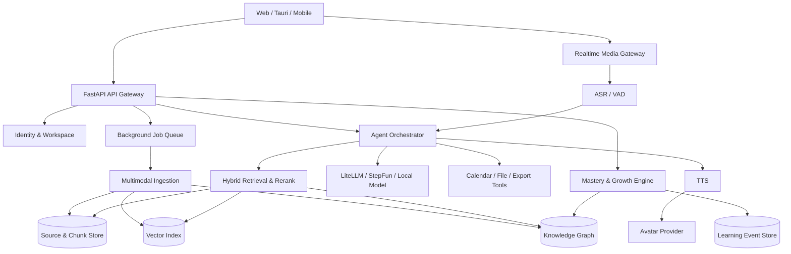

# FileMate AI 产品总规划书（竞赛版）

> 版本：v1.0 · 日期：2026-08-09
> 产品代号：FileMate Campus Twin
> 定位：面向大学生“学习—科研—竞赛—求职”全过程的个人知识与能力智能体

## 0. 执行摘要

FileMate 不应演变成一组互不关联的 AI 按钮。真正有竞争力的产品主线是：

> 用可追溯的个人知识库理解学生学过什么，用动态能力模型判断学生掌握到什么程度，再用可交互的 AI Agent 与数字人帮助学生完成下一次真实任务。

产品从课程文件切入，逐步贯通四个阶段：

1. **Learn**：理解课件、形成笔记、练习、记忆与考试计划。
2. **Research**：阅读论文、管理证据、形成研究问题与实验记录。
3. **Build**：组织竞赛项目、协作推进、生成答辩材料与演示脚本。
4. **Prove**：沉淀作品与能力证据，通过数字人面试、答辩和表达训练验证能力。

### 北极星指标

**每周被用户完成并产生可验证能力增益的 AI 学习任务数。**

它比“上传文件数”“AI 调用次数”更能证明 FileMate 真正促进了成长。

### 一句话比赛叙事

FileMate 是一个拥有长期记忆、证据引用、动态能力画像和具身交互训练能力的大学生个人成长智能体。

---

## 1. 市场参考与机会判断

### 1.1 可借鉴的公开产品能力

#### StudyBai

公开定位强调一站式 AI 学习工作台，覆盖笔记、记忆、练习与考试。它说明中文用户需要的不是孤立工具，而是统一工作空间。

可借鉴：

- 统一 Workspace，而不是每次重新上传文件。
- 笔记、记忆、练习和考试之间可以互相转化。
- 中文考试场景、中文交互与低使用门槛。

不应照搬：

- 仅把多个生成器排列在工具箱里。
- 缺少个人长期能力状态和真实任务验证。

#### StudyX

公开页面可核实的能力包括：PDF、录音、YouTube、文本等多入口；快速笔记；用户编辑与高亮；资料内问答；从同一资料生成卡片和测验；实时课堂录音；视频与幻灯片摘要；写作辅助。

可借鉴：

- **一次导入，多种产物**：同一 Source 派生笔记、卡片、题目、问答与计划。
- **编辑优先**：AI 产物不是终点，用户可以高亮、批注、纠错和重组。
- **多模态入口**：文件、图片、录音、视频、网页、YouTube、文本统一进入知识库。
- **围绕任务组织**：从“上传资料”直接到“我今天要学什么”。

FileMate 的差异化必须是：

- 每个答案都有原文证据和引用定位。
- 每次学习行为都会更新掌握度，而不是生成后即结束。
- 学习、项目、竞赛和求职共享同一个个人能力图谱。
- 数字人训练结果进入能力模型，形成长期进步曲线。

### 1.2 核心机会

现有产品多集中在“内容转换”：PDF 变摘要、摘要变卡片、卡片变测验。FileMate 应向“状态改变”升级：

```text
学习资料 → 可追溯知识 → 学习活动 → 行为证据 → 能力状态变化 → 下一步行动
```

这条闭环同时具备产品价值与科研价值。

---

## 2. 产品战略：一个大脑，四个场景，三条闭环

### 2.1 一个大脑：Personal Knowledge & Skill Twin

系统维护两个相互关联的图：

- **知识图谱**：课程、概念、公式、论文、代码、项目、知识先修关系与出处。
- **能力图谱**：理解、记忆、应用、表达、协作、科研、工程与职业能力及证据。

知识图回答“用户接触过什么”，能力图回答“用户真正会什么”。

### 2.2 四个产品空间

#### 学习空间 LearnSpace

- 多模态资料导入与智能整理。
- 可编辑 AI 笔记、重点、高亮与原文定位。
- 资料内问答、跨资料问答与引用。
- 卡片、题库、错题本、模拟考试。
- 间隔重复和薄弱点驱动复习。
- 考试日期驱动的每日学习计划。
- AI 苏格拉底导师与费曼讲解训练。

#### 科研空间 ResearchSpace

- 论文结构化阅读：问题、方法、数据、结论、局限。
- 多论文对比矩阵与引用关系图。
- 研究问题生成、假设检查与证据链。
- 实验日志、数据集卡、模型卡和复现实验清单。
- 学术写作助手：提纲、论证结构、引用缺口检查。
- 学术诚信提示：引用保留、AI 生成内容标记、事实核验。

#### 项目空间 BuildSpace

- 竞赛任务拆解、里程碑、成员责任和风险看板。
- 从资料与代码自动形成技术架构、功能清单和 Demo 脚本。
- 自动整理周报、会议纪要、证据材料和版本差异。
- 答辩问题库、评委角色模拟、路演计时训练。
- 一键生成项目申报书、技术白皮书、PPT 大纲与视频脚本。
- 形成“需求—实现—测试—证据—成果”的可审计链。

#### 成长空间 CareerSpace

- 简历解析与项目经历证据化。
- 岗位 JD 技能图谱与个人差距分析。
- AI 模拟面试：行为面、技术面、压力面、群面、英语面。
- AI 答辩训练：竞赛答辩、开题、中期、毕业答辩。
- 演讲训练：语速、停顿、口头禅、结构、眼神与肢体反馈。
- 作品集自动聚合：课程成果、论文、竞赛、代码、证书和能力证明。

### 2.3 三条关键闭环

#### 闭环 A：Evidence-Grounded Knowledge Loop

资料进入系统后被解析、分块、向量化、概念化。所有回答、卡片、题目和笔记保留来源片段、页码或时间戳。用户纠错反向更新知识库。

#### 闭环 B：Mastery Adaptation Loop

系统记录答题正确率、信心、反应时间、提示次数、遗忘情况和任务完成度，更新每个概念的掌握概率，并决定下一道题、下一张卡和下一项任务。

#### 闭环 C：Embodied Practice Loop

数字人根据课程、简历、项目和岗位生成场景，进行实时追问；系统分析内容质量、表达方式与非语言信号，生成可定位的反馈；再次练习验证是否改进。

---

## 3. 竞赛级创新点设计

### 创新 1：证据约束的个人知识图谱 RAG

普通 RAG 只检索相似文本。FileMate 同时检索：原文片段、概念关系、用户掌握状态和当前目标。

```text
问题
  → 意图与目标识别
  → 混合检索（BM25 + Dense Vector）
  → 概念图扩展（Prerequisite / Related / Evidence）
  → 重排序
  → 带引用生成
  → 忠实度与引用覆盖率检查
```

科研指标：Recall@K、MRR、引用正确率、回答忠实度、跨文档推理正确率。

### 创新 2：知识—能力双图谱与可解释知识追踪

不只记录“做对/做错”，还记录答案证据、作答信心、提示使用、表达表现和真实项目成果。

MVP 可采用规则加权与 Bayesian Knowledge Tracing；后续对比 IRT、DKT 或 Transformer Knowledge Tracing。每次能力变化必须能解释“由哪次行为证据导致”。

科研指标：掌握度预测 AUC、校准误差、学习增益、复习推荐命中率。

### 创新 3：目标反推式成长 Agent

用户输入目标（期末 85 分、完成挑战杯、获得算法实习），Agent 从目标技能图反推当前差距，生成任务图，并根据完成情况动态重规划。

Agent 不是无限自主执行，而采用分级权限：

- L0 只读分析。
- L1 生成建议。
- L2 用户确认后写入日程、移动文件或创建任务。
- L3 在明确策略与审计日志下执行批量操作。

### 创新 4：知识状态驱动的数字人训练

数字人不使用固定题库。它读取用户资料、项目证据、岗位要求和薄弱点动态追问：

- 用户声称“熟悉 RAG”但证据不足时，追问分块、召回和评估。
- 用户回答含糊时，要求给出项目中的具体数据。
- 用户表现稳定后提升难度或切换为压力面试。

这比“数字人播报答案”更能形成技术壁垒。

### 创新 5：本地优先的个人 AI 数据治理

课程文件、面试录像和能力画像高度敏感。FileMate 采用本地优先、可导出、可删除、可审计的设计：

- 原文件与身份数据默认本地保存。
- 云模型只接收必要片段，可配置脱敏。
- 面部与声音克隆必须单独授权。
- AI 评价展示依据与不确定性，不做不可解释的人格判断。

该能力既是安全底线，也可成为政务/教育类比赛的治理亮点。

---

## 4. 功能全景

### 4.1 Source Hub：统一资料中心

- PDF、Word、PPT、TXT、Markdown、图片、扫描件、代码压缩包。
- 网页、公众号文章、YouTube/Bilibili 链接、公开课程视频。
- 实时课堂录音、上传音频、自动转写、说话人分离。
- Google Drive、OneDrive、WebDAV 和本地文件夹同步。
- 文档页码、幻灯片页、音视频时间戳统一引用。
- 重复文件检测、版本关系、课程自动归档。
- 用户高亮、批注、标签、收藏和手动纠错。

### 4.2 AI Study Studio：学习内容工作室

- 多粒度摘要：一句话、考试重点、章节详解、研究式摘要。
- 结构化笔记：康奈尔笔记、提纲、表格、思维导图。
- 难点解释：类比、逐步推导、前置知识补齐。
- 公式解释、代码解释、图表理解和图片 OCR。
- 从同一资料生成卡片、测验、题库、学习指南和音频回顾。
- 卡片与题目都可编辑、删除、合并、标记出处。
- 多语言翻译与双语术语表。
- AI 微课脚本与数字人讲解视频。

### 4.3 Active Learning Engine：主动学习引擎

- FSRS/SM-2 间隔重复排程。
- 主动回忆模式：先作答，后显示答案和证据。
- 题型：选择、判断、填空、简答、计算、编程、口述。
- 难度自适应与知识点覆盖控制。
- 错题自动归因：概念缺失、计算错误、审题错误、表达不完整。
- 每日复习队列、临考冲刺、模考与考试复盘。
- 学习专注计时、打断记录、计划自动重排。

### 4.4 Grounded Tutor：有证据的 AI 导师

- 单文档和跨文档问答。
- 回答逐句引用、页码跳转、证据高亮。
- “文档没有答案”时明确拒答或建议补充资料。
- 苏格拉底模式：以问题引导，不直接给最终答案。
- 费曼模式：用户讲解，AI 查漏补缺。
- 作业辅导模式：提供提示阶梯，避免直接代做。
- 教师/课程规则可配置。

### 4.5 Knowledge & Skill Twin：知识能力数字孪生

- 课程知识地图、概念先修关系、跨课程关联。
- 掌握度、遗忘风险、证据数量和最近验证时间。
- 目标技能图：保研、考研、竞赛、岗位或证书。
- 能力雷达：学术、工程、表达、协作、创新、职业。
- 每个能力可展开到证据：题目、项目、论文、面试片段。
- 周/月成长报告与下一步建议。

### 4.6 Digital Human Lab：数字人训练实验室

#### 数字人角色

- AI 教师：讲解课件、回答追问、组织口试。
- AI 面试官：技术面、行为面、压力面、群面和英语面。
- AI 评委：挑战杯、互联网+、创新创业比赛和科研答辩。
- AI 患者/客户/群众：服务医疗、师范、营销、政务等专业实训。
- AI 队友：小组讨论、辩论和协作冲突训练。

#### 交互链路

```text
摄像头/麦克风
  → VAD + ASR
  → 场景状态机 + 面试/教学 Agent
  → RAG 与评分 Rubric
  → 流式 TTS
  → 数字人表情与口型
  → 多模态分析与时间轴反馈
```

#### 评价维度

- 内容：正确性、深度、结构、证据、岗位/题目匹配度。
- 表达：语速、停顿、口头禅、简洁度、STAR 结构。
- 互动：倾听、追问响应、澄清和压力恢复。
- 非语言：视线、姿态和表情；只给训练建议，不做人格或招聘结论。
- 进步：跨多次训练的指标趋势与问题复现率。

#### 实现策略

- 第一阶段使用 2D/静态头像 + 流式语音，优先证明对话和评价闭环。
- 第二阶段接入供应商适配层，可选择 HeyGen、LiveAvatar 或其他 API。
- 第三阶段研究本地 Live2D/3D 渲染，降低成本并增强隐私。
- 所有数字人供应商通过 `AvatarProvider` 接口隔离，避免产品被单一平台锁定。

### 4.7 AI Mock Interview：AI 模拟面试

- 从简历、项目资料和 JD 自动生成问题树。
- 面试类型：自我介绍、行为面、项目深挖、技术面、系统设计、编程、英语、群面。
- 基于回答动态追问，而不是顺序播放固定题库。
- 支持白板、代码编辑器和作品展示。
- 生成逐句转写、时间轴标签、评分依据与改进示例。
- “证据核验”：简历描述是否能被代码、文档和结果数据支持。
- 复练模式只针对上次薄弱项。
- 教师/就业中心可创建院系专属 Rubric 和岗位题库。

### 4.8 Competition Copilot：竞赛智能协作

- 比赛通知解析、赛道匹配、资格与截止日期提取。
- 申报书结构检查、创新性对比和证据缺口提示。
- 项目任务图、周计划、风险、负责人和版本状态。
- 自动生成评委问题，数字人进行多轮答辩。
- 演示异常演练：网络断开、模型失败、数据缺失时的备用路径。
- 成果包：代码、测试报告、用户研究、演示视频、专利/软著和答辩材料。

### 4.9 Platform Foundation：平台能力

- 本地账号、云账号、访客模式和多工作区。
- SQLite 本地版；PostgreSQL + 对象存储服务版。
- Windows Tauri 桌面端、Web、移动响应式和 PWA。
- 中英文 i18n、无障碍、离线查看与断点续传。
- 模型网关：StepFun 为主，兼容 OpenAI 协议和本地模型。
- 成本预算、请求队列、缓存、重试、限流和降级。
- 操作审计、可撤销文件操作、数据导出和彻底删除。

---

## 5. 技术架构



### 5.1 架构原则

1. **先统一数据模型，再增加功能页面。**
2. **本地优先、云端可选。**
3. **所有 AI 输出带 provenance。**
4. **长任务全部异步化并可恢复。**
5. **模型、向量库、数字人均使用 Provider 接口。**
6. **Agent 写操作必须授权、审计、可撤销。**

### 5.2 建议数据实体

- `users`、`workspaces`、`memberships`
- `sources`、`source_versions`、`chunks`、`citations`
- `concepts`、`concept_relations`、`concept_evidence`
- `artifacts`：note、card、quiz、summary、mindmap、audio、video
- `learning_events`、`mastery_states`、`review_schedules`
- `goals`、`plans`、`plan_tasks`
- `agent_runs`、`tool_calls`、`approvals`、`audit_logs`
- `interview_scenarios`、`interview_turns`、`rubrics`、`scores`
- `portfolio_items`、`skill_evidence`

### 5.3 技术选型建议

- API：FastAPI + Pydantic + SQLAlchemy/Alembic。
- 后台任务：轻量 MVP 使用 FastAPI BackgroundTasks；稳定版使用 Dramatiq/Celery + Redis。
- 本地数据库：SQLite；服务端：PostgreSQL。
- 本地向量：sqlite-vec 或 Chroma；服务端：pgvector。避免 MVP 同时维护三套数据库。
- 图谱 MVP：关系表 + NetworkX；数据量和查询复杂度证明必要后再引入 Neo4j。
- 检索：BM25 + dense embedding + reranker。
- 学习排程：FSRS；掌握估计先 BKT/规则模型，保留算法替换接口。
- 模型：LiteLLM 统一网关，StepFun 主模型，小模型负责分类与抽取。
- 实时语音：WebRTC/WebSocket + 流式 ASR/TTS。
- 桌面：Tauri 2，Rust 只负责系统能力和安全文件访问。

---

## 6. 下一阶段 7 项工作的落地定义

### P0-1 真正的向量 RAG 与引用

交付：多文档知识库、分块、Embedding、混合检索、重排、页码引用和来源跳转。

验收：

- 50 个课程问答评测集 Recall@5 ≥ 0.85。
- 引用正确率 ≥ 90%。
- 无证据问题明确拒答率 ≥ 95%。
- 知识库重启后仍可使用。

### P0-2 确认执行与撤销

交付：确认后真正归档、重命名、写入日历；操作预览；冲突处理；撤销日志。

验收：所有文件写操作有审批记录，误操作可恢复，重复执行幂等。

### P0-3 持久化、认证与多工作区

交付：用户、工作区、Source、Artifact、Context、Plan 全部持久化；本地账号与云账号边界清晰。

验收：重启不丢数据；两个用户数据隔离；可导出和删除个人数据。

### P0-4 互动测验、掌握度与间隔重复

交付：先答后看、自动评分、信心度、错题本、FSRS 排程、概念掌握度更新。

验收：完成一次测验后能解释哪些知识点升降；错题进入复习队列；复练结果形成趋势。

### P1-5 Tauri 桌面产品化

交付：完整 Cargo 工程、Sidecar 后端、自动启动、托盘、目录监控、安装包和升级策略。

验收：干净 Windows 机器一键安装；无 Python 环境也能运行；卸载不误删用户资料。

### P1-6 工程化与发布

交付：CI、类型检查、测试、Docker、迁移脚本、日志、错误追踪、版本发布说明。

验收：PR 自动执行后端测试和前端构建；数据库升级可回滚；核心链路有健康检查。

### P1-7 前端性能与体验

交付：Element Plus 按需加载、ECharts 按组件引入、长列表虚拟化、上传任务中心、移动端验证。

验收：首页首屏压缩资源显著下降；慢任务有进度与恢复；主流程满足键盘操作和基础无障碍。

---

## 7. 分阶段路线图

### Phase 0：可信基础（2026-08-10 至 2026-08-24）

目标：把当前 Demo 变成数据不丢、链路真实、可持续开发的产品底座。

- ✅ 完成 P0-2 确认执行与撤销（含操作快照、冲突保护、失败回滚和幂等）。
- ✅ 统一 Source/Artifact/Context 数据模型并接入全部 AI 学习工具。
- ✅ 建立数据库 v1–v3 迁移与统一 `{success,data,error}` API 错误规范。
- ✅ 建立 GitHub Actions、后端测试、Ruff、前端构建与安全关键路径测试。
- ✅ 建立可安装 Python 包元数据、发布分支策略和工作区隔离规则。
- ✅ 建立 Tauri 2 Cargo 工程、FastAPI sidecar、自动启停、应用数据隔离、NSIS/MSI 配置与 Windows CI 构建任务。
- ✅ 本地构建 43.88 MiB Python Sidecar，并通过 API 就绪、SQLite 创建、令牌关闭、Uvicorn 完整关闭与端口释放冒烟。
- ✅ CI 已加入 Sidecar 冒烟、NSIS/MSI 双产物检查、隔离 Python PATH 启动、静默安装/卸载和用户数据保留验收。
- 🟡 Tauri Rust 主程序与桌面安装包仍待 Windows 构建产物和干净机器证据；不得用前端或 Sidecar 构建通过替代该证据。

截至 2026-08-09，Phase 0 的数据持久化、可信写操作、质量门禁和 Python Sidecar 主链路已提前完成；详细门禁见 `docs/PHASE0_ACCEPTANCE_REPORT.md`。下一检查点为 Rust/Cargo 编译、Windows 安装包产物、干净机冒烟和卸载数据保护证据。

里程碑：`v1.2 Reliable Foundation`。

### Phase 1：学习闭环（2026-08-25 至 2026-09-30）

目标：形成比普通 PDF 摘要器更完整的可演示闭环。

- 多文档 RAG、引用定位与证据高亮。
- 可编辑笔记、高亮和批注。
- 互动测验、错题本、FSRS 与掌握度 MVP。
- 学习计划根据完成与错题自动重排。
- 课堂录音转写 MVP。

里程碑：`v1.5 Active Learning`。

### Phase 2：知识与能力数字孪生（2026-10-01 至 2026-11-30）

目标：形成核心科研创新与竞赛数据。

- 课程概念图谱与先修关系。
- 知识—能力双图谱。
- BKT/规则基线与对照实验。
- 个人目标、技能差距和成长路径。
- 周报、能力证据与可解释推荐。

里程碑：`v2.0 Campus Twin`。

### Phase 3：数字人与模拟面试（2026-12-01 至 2027-02-28）

目标：把知识智能体扩展为可交互的职业与答辩训练系统。

- 流式 ASR/TTS、场景状态机和追问 Agent。
- 简历 + JD + 项目证据驱动面试。
- 行为面、技术面、竞赛答辩三个场景。
- 内容、表达和互动 Rubric。
- 首版数字人 Provider；优先支持低成本 2D/静态头像，随后接入高拟真服务。
- 多轮进步报告和复练任务。

里程碑：`v2.5 Embodied Coach`。

### Phase 4：竞赛与科研平台化（2027-03-01 至 2027-06-30）

目标：形成团队版、院校版和完整比赛材料。

- 多成员项目空间、教师/导师端。
- 竞赛 Copilot、答辩数字人、多评委 Agent。
- 数据集、消融实验、用户实验与技术论文。
- 桌面安装包、云端部署和隐私合规模型。
- 作品集、软著、专利、论文与商业计划书。

里程碑：`v3.0 Growth Intelligence Platform`。

---

## 8. 竞赛包装与成果设计

### 8.1 推荐主赛题

**面向大学生全过程成长的知识—能力双图谱智能体与数字人实训平台。**

### 8.2 三段式现场 Demo

1. 导入一套课程资料，系统建立带引用的知识库和知识地图。
2. 用户完成 3 道自适应题，能力画像发生可解释变化，计划自动重排。
3. 数字人围绕用户项目进行面试/答辩追问，生成时间轴反馈并把表现写入能力证据。

### 8.3 可量化成果

- 文档解析准确率、检索 Recall@K、引用正确率。
- 学习前后测提升、遗忘率变化、计划完成率。
- 面试内容评分与专家评分相关性。
- 用户任务完成时间、周活跃学习任务和留存。
- 本地化运行成本、单次学习任务模型成本。

### 8.4 实验设计

- 对照 A：普通 LLM 问答 vs 带引用 GraphRAG。
- 对照 B：固定题目顺序 vs 掌握度自适应。
- 对照 C：文本面试 vs 数字人多模态面试。
- 消融：去掉知识图、去掉用户状态、去掉证据重排。
- 用户研究：不同专业、不同年级、不同目标群体。

### 8.5 成果资产包

- 可安装产品与公开演示环境。
- 匿名化评测数据集和评价脚本。
- 技术白皮书、系统架构、API 文档和模型卡。
- 用户研究报告、伦理与隐私说明。
- 软件著作权、专利交底书、论文或技术报告。
- 3 分钟演示视频、8 分钟答辩稿和常见问题库。

---

## 9. 产品指标体系

### 激活

- 首次导入后 10 分钟内生成并保存一个有效学习产物。
- 首次导入到第一次有引用问答的完成率。

### 学习效果

- 每周完成的主动回忆任务数。
- 概念掌握度提升与 7/30 天保持率。
- 错题复练正确率和计划完成率。

### 职业训练

- 模拟面试完成率、复练率。
- 内容结构、语速、口头禅等指标变化。
- 专家评分与系统评分的一致性。

### 质量与信任

- 引用正确率、拒答正确率、幻觉反馈率。
- 写操作撤销成功率和数据恢复成功率。
- P95 响应时间、任务失败率和每任务成本。

---

## 10. 安全、伦理与学术诚信

- 区分“辅导”与“代做”；作业模式优先给提示阶梯。
- AI 生成内容保留标记、来源和修改记录。
- 面试视频、声音和面部数据默认本地，单独授权上传。
- 不根据表情推断人格、情绪疾病或录用结论。
- 评分 Rubric 对用户可见，允许人工复核和纠错。
- 防御文档 Prompt Injection；外部文档内容不得提升 Agent 权限。
- 文件写操作、日历写入和外部发送必须用户确认。
- 支持数据导出、保留期限和彻底删除。

---

## 11. 团队与实施建议

### 建议工作流

- 每个阶段只维护一个可演示主链路。
- 每项功能必须同时拥有：用户故事、API、数据模型、测试、指标和演示证据。
- 新功能先进入 Provider/Service 层，再接 UI，避免逻辑堆在 FastAPI 路由中。
- 每两周形成可安装版本和 3 分钟录屏。

### 决策门槛

- 没有真实数据证明前，不提前引入 Neo4j、复杂多 Agent 或昂贵数字人服务。
- 数字人第一版先验证“动态追问 + 可量化反馈”，高拟真形象属于增强项。
- 功能丰富不能牺牲主线；任何新功能必须至少服务知识闭环、能力闭环或训练闭环之一。

---

## 12. 公开参考资料

- StudyBai Workspace：https://www.studybai.com/workspace/
- StudyX AI PDF Summarizer：https://studyx.ai/ai-pdf-summarizer
- StudyX 产品能力：https://studyx.ai/
- Gemini Notebook Flashcards & Quizzes：https://support.google.com/gemininotebook/answer/16958963
- StudyFetch：https://www.studyfetch.com/
- UneeQ Education Immersive Training：https://www.digitalhumans.com/immersive-training-education
- HeyGen Developer Platform：https://developers.heygen.com/

> 参考产品用于提炼用户需求与交互模式。FileMate 的核心创新应通过自主的数据闭环、算法评测和真实用户实验来证明。
